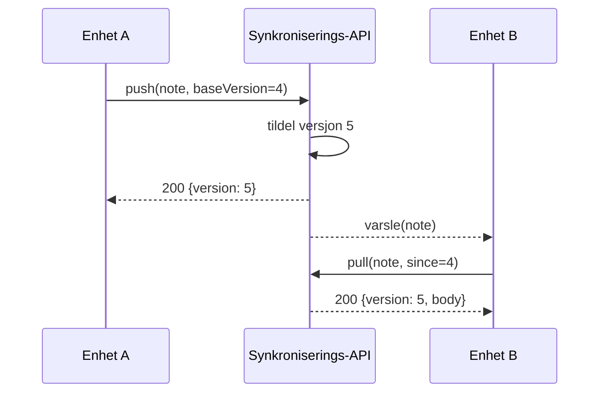

---
navigation:
  order: 20
---

# 3.2 Synkroniseringsflyten

Endringen fra enhet A får en ny versjon på serveren, og enhet B henter den når den har fått varselet. Varselet er et signal om å hente; det inneholder ikke selve teksten.
