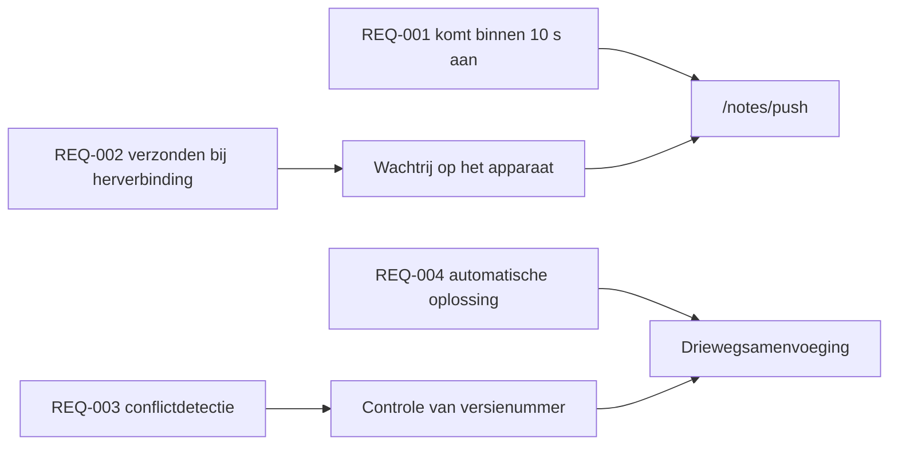

---
navigation:
  order: 30
---

# 2.3 Traceerbaarheid van eisen

Eisen worden gekoppeld aan de elementen van [de architectuur](../03-architecture/README.md) en aan de eindpunten van [de API](../04-api/README.md). Een eis zonder koppeling geldt als niet geïmplementeerd.

