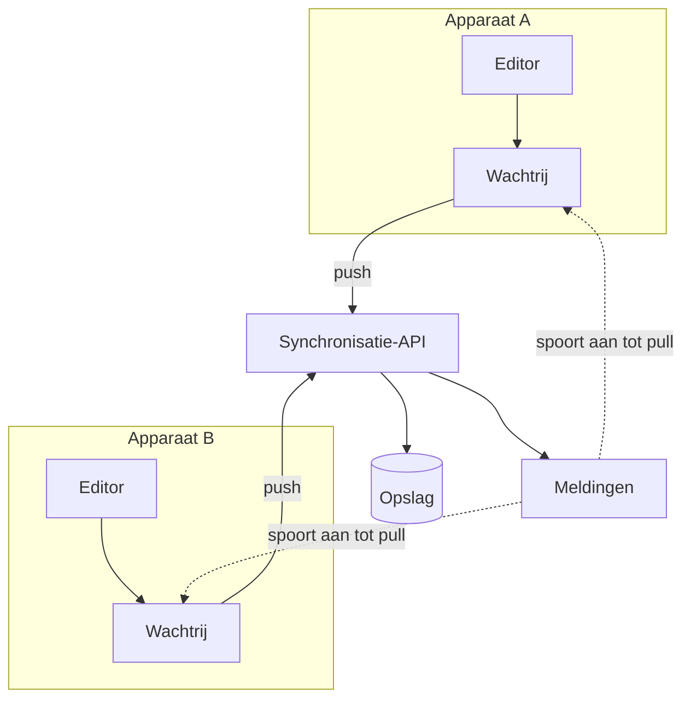

---
navigation:
  order: 10
---

# 3.1 Onderdelen

| Element | Rol |
|---|---|
| Client | Bewaakt bewerkingen van notities, plaatst de wijzigingen in een wachtrij en stuurt ze bij verbinding naar de server |
| Synchronisatie-API | Neemt wijzigingen aan, kent versienummers toe en verspreidt ze naar andere apparaten |
| Opslag | Bevat de huidige inhoud van elke notitie en de geschiedenis van de afgelopen 30 dagen |
| Meldingen | Stuurt een licht signaal naar een apparaat om op te halen wanneer er een wijziging is |

