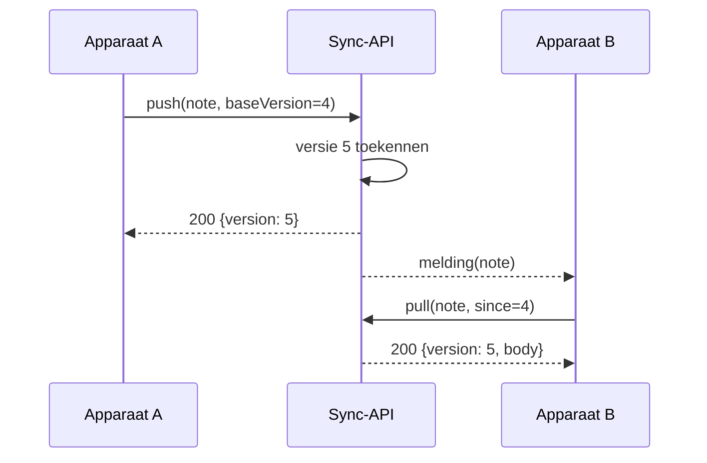

---
navigation:
  order: 20
---

# 3.2 Het synchronisatieverloop

De wijziging van apparaat A krijgt op de server een nieuwe versie, en apparaat B haalt die op zodra het een melding heeft gekregen. De melding is een signaal om op te halen; ze bevat de inhoud niet.
