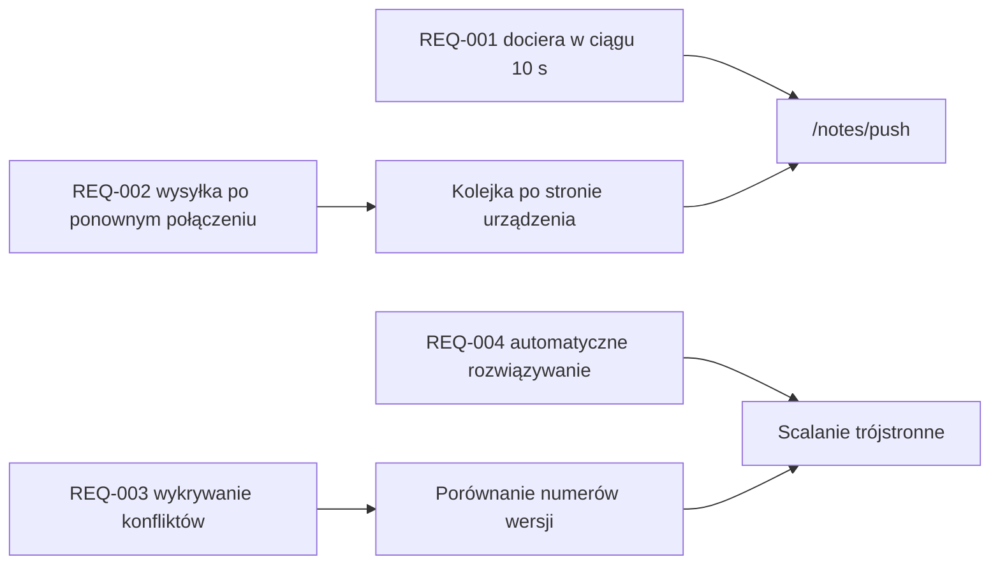

---
navigation:
  order: 30
---

# 2.3 Śledzenie wymagań

Wymagania są przyporządkowane do poszczególnych elementów [architektury](../03-architecture/README.md) oraz do poszczególnych punktów końcowych [API](../04-api/README.md). Wymaganie bez przyporządkowania traktuje się jako niezaimplementowane.

