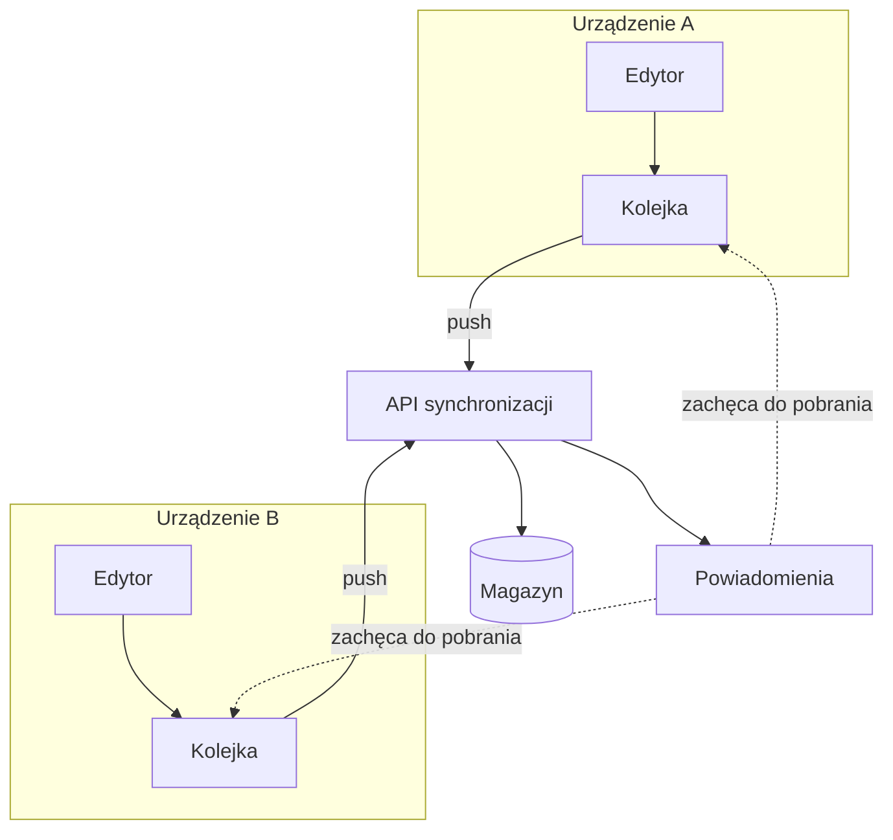

---
navigation:
  order: 10
---

# 3.1 Elementy składowe

| Element | Rola |
|---|---|
| Klient | Śledzi zmiany w notatkach, umieszcza je w kolejce i wysyła na serwer po nawiązaniu połączenia |
| API synchronizacji | Przyjmuje zmiany, nadaje numery wersji i rozsyła je do pozostałych urządzeń |
| Magazyn | Przechowuje bieżącą treść każdej notatki oraz jej historię z ostatnich 30 dni |
| Powiadomienia | Wysyła lekki sygnał zachęcający urządzenie do pobrania zmian, gdy zmiana wystąpiła |

