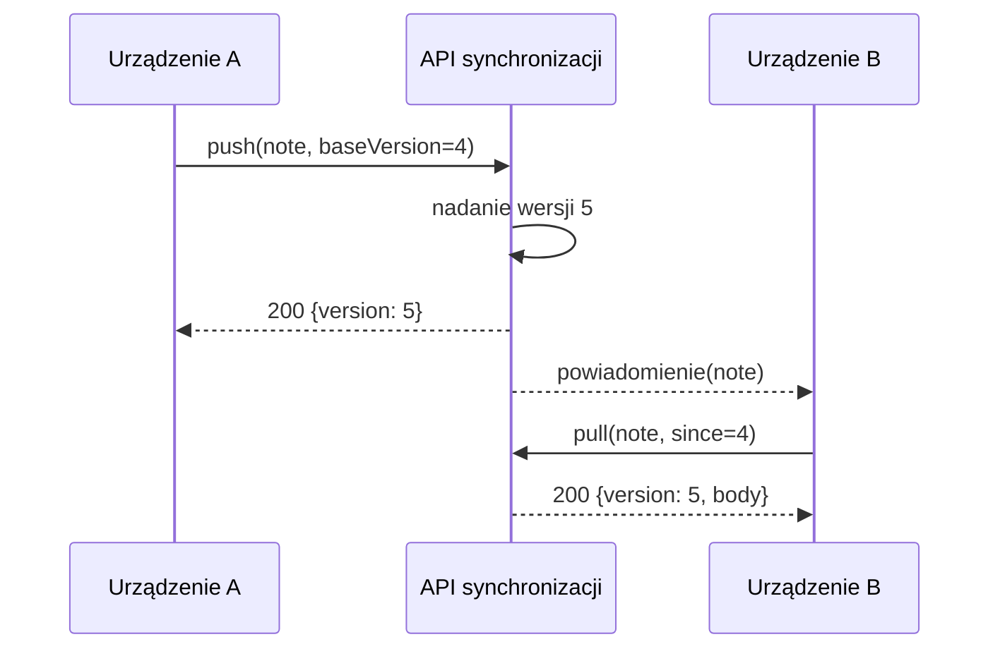

---
navigation:
  order: 20
---

# 3.2 Przebieg synchronizacji

Zmiana z urządzenia A otrzymuje na serwerze nową wersję, a urządzenie B pobiera ją po otrzymaniu powiadomienia. Powiadomienie jest sygnałem zachęcającym do pobrania — nie przenosi treści.
