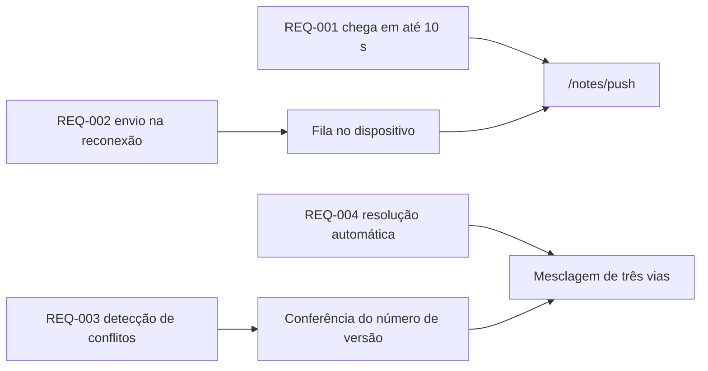

---
navigation:
  order: 30
---

# 2.3 Rastreabilidade dos requisitos

Os requisitos são associados a cada elemento da [arquitetura](../03-architecture/README.md) e a cada endpoint da [API](../04-api/README.md). Um requisito sem associação é tratado como não implementado.

