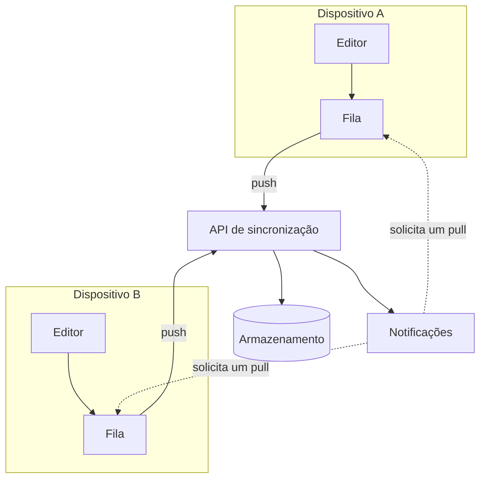

---
navigation:
  order: 10
---

# 3.1 Componentes

| Elemento | Função |
|---|---|
| Cliente | Monitora as edições das notas, coloca as alterações em fila e as envia ao servidor quando há conexão |
| API de sincronização | Recebe as alterações, atribui números de versão e as distribui aos demais dispositivos |
| Armazenamento | Guarda o conteúdo atual de cada nota e o histórico dos últimos 30 dias |
| Notificações | Envia um sinal leve ao dispositivo, quando houve alguma alteração, para que ele busque os dados |

