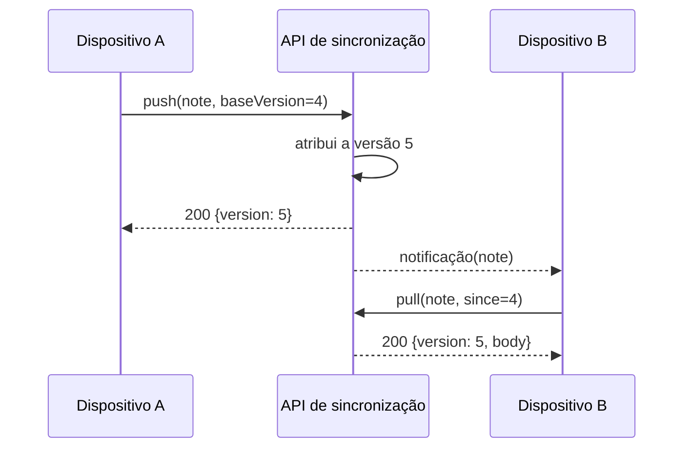

---
navigation:
  order: 20
---

# 3.2 O fluxo de sincronização

A alteração do dispositivo A recebe uma nova versão no servidor, e o dispositivo B a obtém depois de ser notificado. A notificação é apenas um aviso para obter o conteúdo; ela não transporta o corpo do documento.
