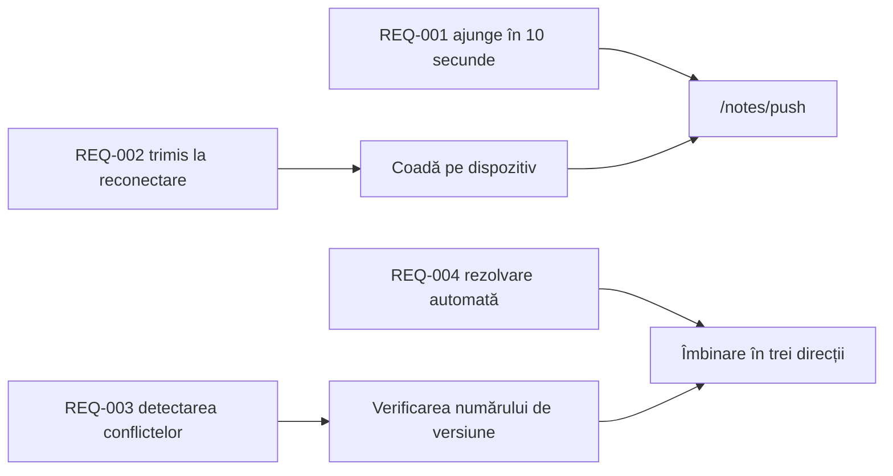

---
navigation:
  order: 30
---

# 2.3 Trasabilitatea cerințelor

Cerințele se pun în corespondență cu elementele din [arhitectură](../03-architecture/README.md) și cu punctele finale din [API](../04-api/README.md). O cerință fără corespondență este considerată neimplementată.

