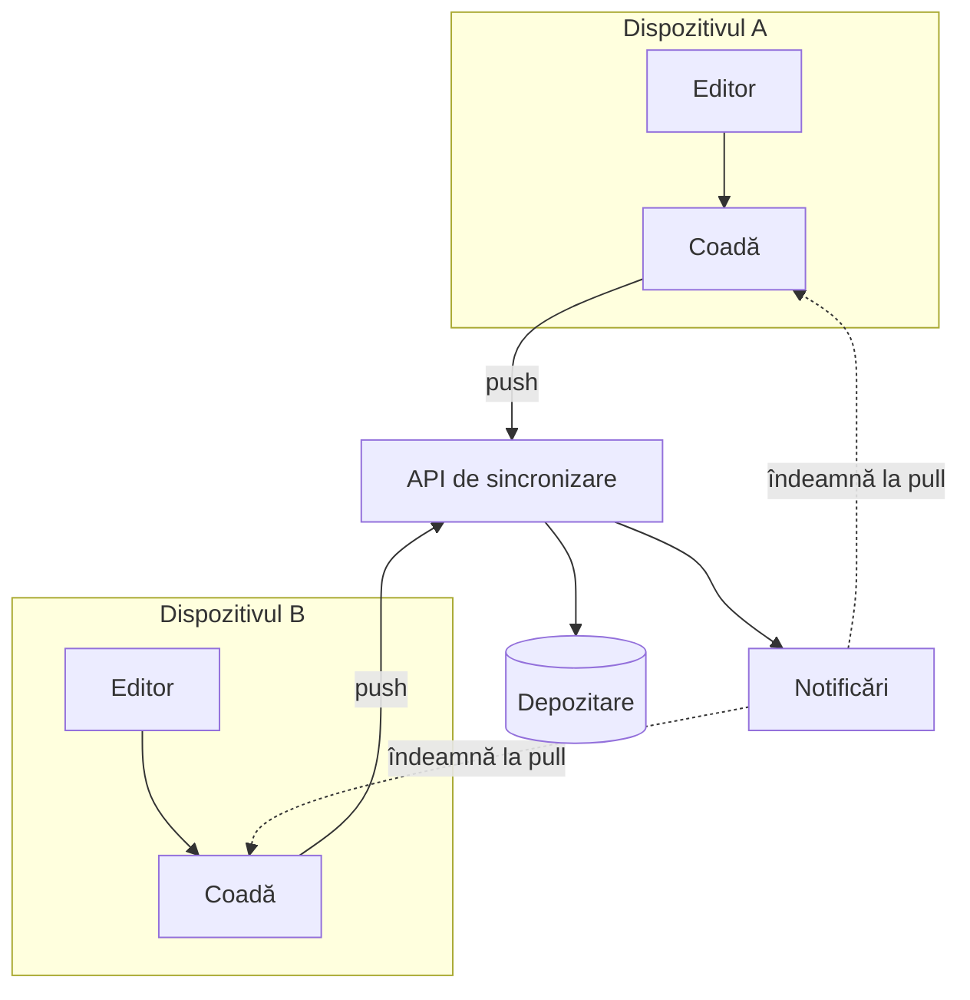

---
navigation:
  order: 10
---

# 3.1 Componente

| Element | Rol |
|---|---|
| Client | Urmărește modificările notițelor, pune schimbările în coadă și le trimite serverului la conectare |
| API de sincronizare | Preia modificările, atribuie numere de versiune și le distribuie celorlalte dispozitive |
| Depozitare | Conținutul curent al fiecărei notițe și istoricul ultimelor 30 de zile |
| Notificări | Trimite un semnal ușor către dispozitivele afectate de o modificare, pentru a le îndemna să preia datele |

