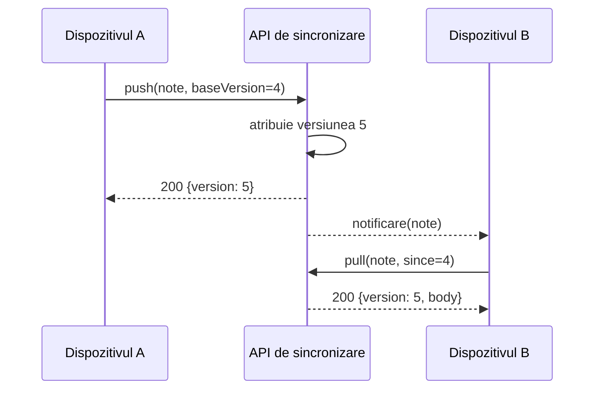

---
navigation:
  order: 20
---

# 3.2 Fluxul de sincronizare

Modificarea de pe dispozitivul A primește o versiune nouă pe server, iar dispozitivul B o preia după ce este notificat. Notificarea este doar un semnal care îndeamnă la preluare; ea nu transportă conținutul.
