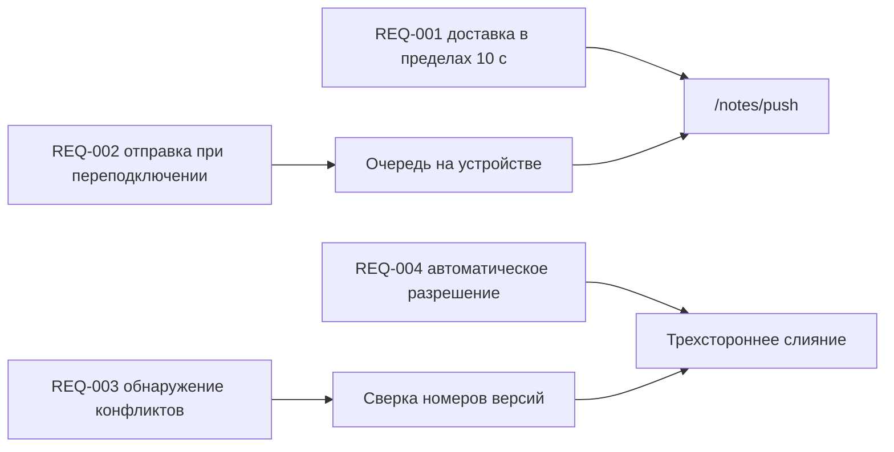

---
navigation:
  order: 30
---

# 2.3 Трассируемость требований

Требования сопоставляются с элементами [архитектуры](../03-architecture/README.md) и с конечными точками [API](../04-api/README.md). Требование без сопоставления считается нереализованным.

