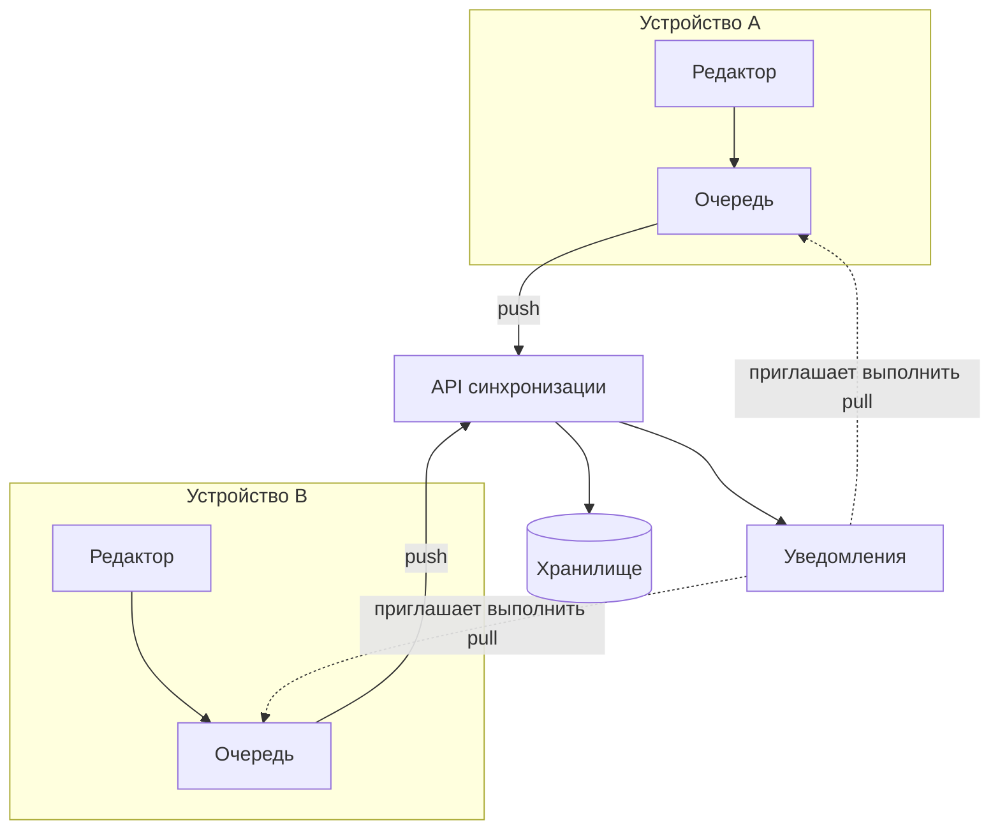

---
navigation:
  order: 10
---

# 3.1 Компоненты

| Элемент | Роль |
|---|---|
| Клиент | Отслеживает изменения заметок, ставит их в очередь и при подключении отправляет на сервер |
| API синхронизации | Принимает изменения, присваивает номера версий и рассылает их на другие устройства |
| Хранилище | Хранит текущее содержимое каждой заметки и историю за последние 30 дней |
| Уведомления | При изменении отправляет устройству легкий сигнал с приглашением получить данные |

