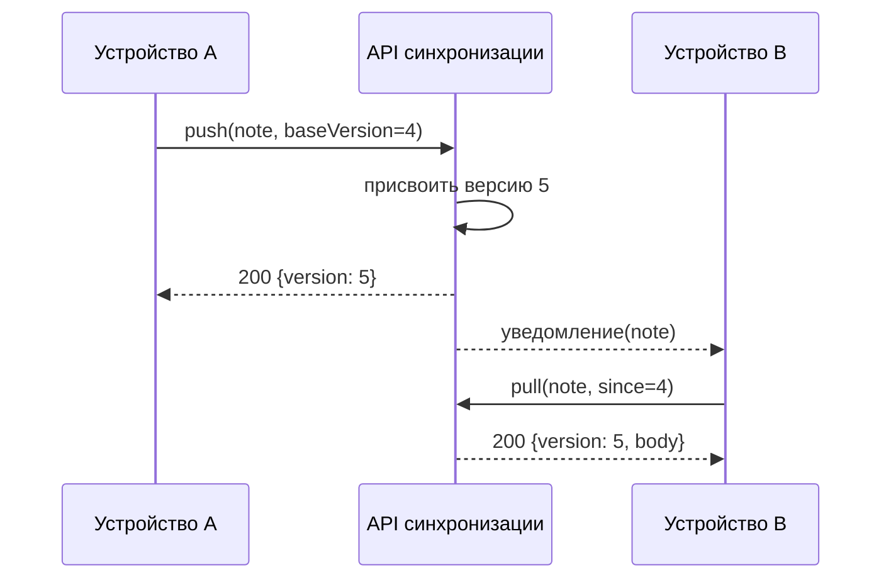

---
navigation:
  order: 20
---

# 3.2 Поток синхронизации

Изменение с устройства A получает на сервере новую версию, а устройство B, получив уведомление, забирает её. Уведомление — это сигнал к получению, оно не несёт самого текста.
