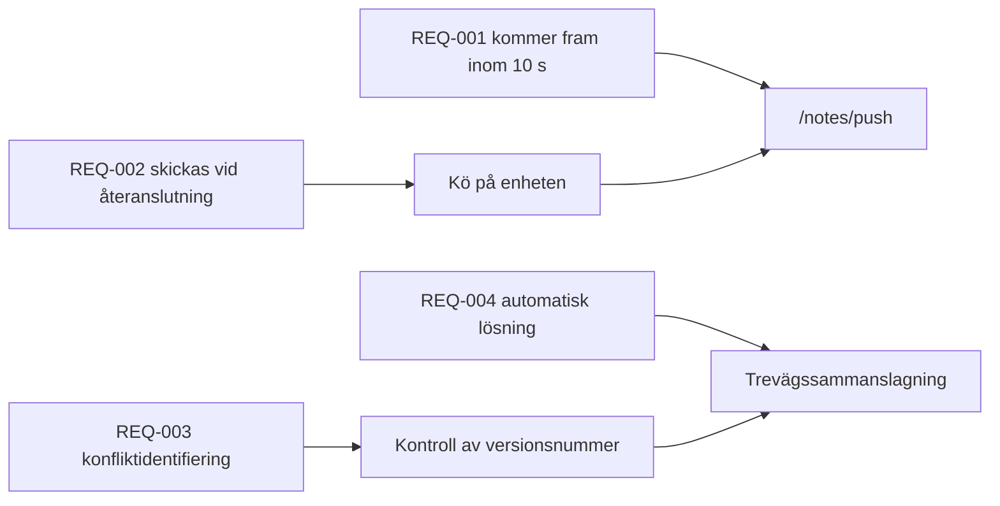

---
navigation:
  order: 30
---

# 2.3 Spårbarhet av krav

Kraven kopplas till elementen i [arkitekturen](../03-architecture/README.md) och till slutpunkterna i [API:et](../04-api/README.md). Ett krav utan koppling betraktas som ej implementerat.

