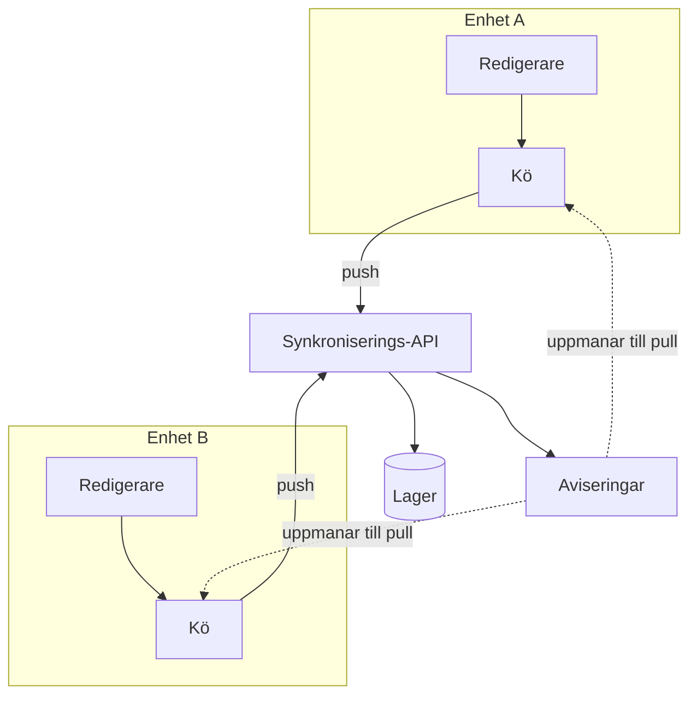

---
navigation:
  order: 10
---

# 3.1 Komponenter

| Element | Roll |
|---|---|
| Klient | Bevakar ändringar i anteckningar, köar ändringarna och skickar dem till servern vid anslutning |
| Synkroniserings-API | Tar emot ändringar, tilldelar versionsnummer och distribuerar dem till andra enheter |
| Lager | Innehåller varje anteckopnings aktuella innehåll och de senaste 30 dagarnas historik |
| Aviseringar | Skickar en lätt signal till en enhet för att uppmana till hämtning när en ändring har skett |

