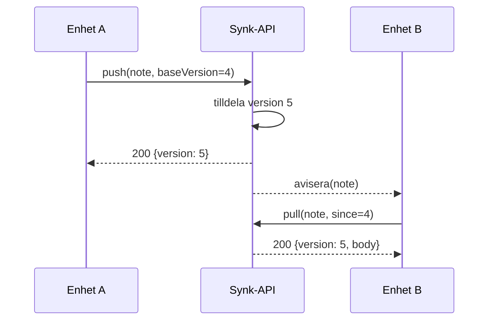

---
navigation:
  order: 20
---

# 3.2 Synkroniseringsflödet

Ändringen på enhet A får en ny version på servern, och enhet B hämtar den när den har aviserats. Aviseringen är en signal om att hämta; den bär inte med sig något innehåll.
