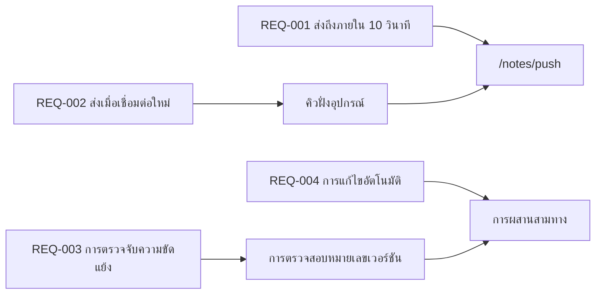

---
navigation:
  order: 30
---

# 2.3 การติดตามข้อกำหนด

ข้อกำหนดแต่ละข้อจะเชื่อมโยงกับองค์ประกอบต่าง ๆ ใน[โครงสร้าง](../03-architecture/README.md) และกับปลายทางแต่ละรายการของ [API](../04-api/README.md) ข้อกำหนดที่ไม่มีการเชื่อมโยงจะถือว่ายังไม่ได้พัฒนา

