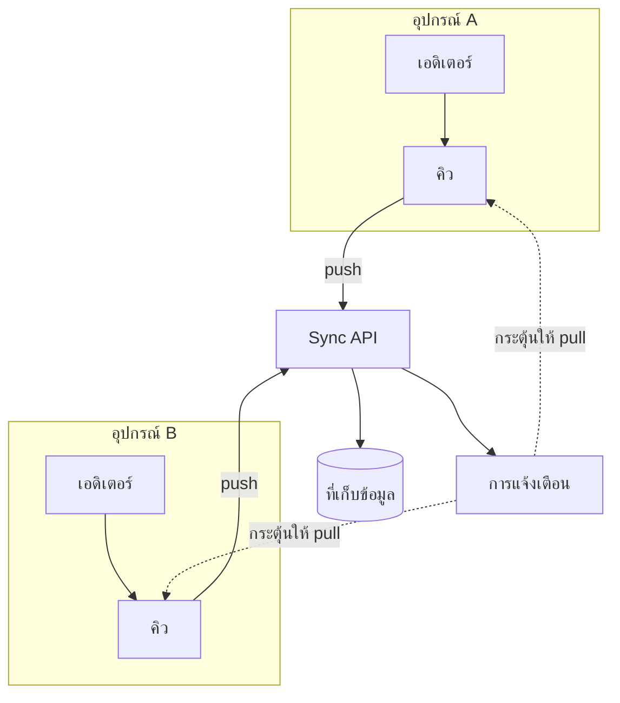

---
navigation:
  order: 10
---

# 3.1 ส่วนประกอบ

| ส่วนประกอบ | บทบาท |
|---|---|
| ไคลเอ็นต์ | เฝ้าดูการแก้ไขบันทึก จัดคิวการเปลี่ยนแปลง และส่งไปยังเซิร์ฟเวอร์เมื่อเชื่อมต่อ |
| Sync API | รับการเปลี่ยนแปลง กำหนดหมายเลขเวอร์ชัน และกระจายไปยังอุปกรณ์อื่น |
| ที่เก็บข้อมูล | เนื้อหาปัจจุบันของบันทึกแต่ละรายการ และประวัติย้อนหลัง 30 วันล่าสุด |
| การแจ้งเตือน | ส่งสัญญาณขนาดเล็กไปยังอุปกรณ์ที่มีการเปลี่ยนแปลง เพื่อกระตุ้นให้ดึงข้อมูล |

