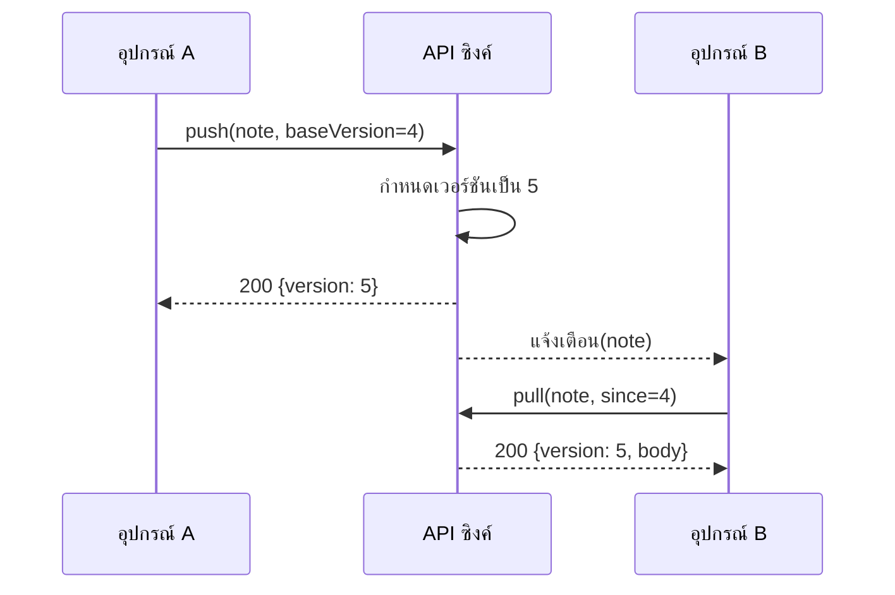

---
navigation:
  order: 20
---

# 3.2 ลำดับการซิงค์

การเปลี่ยนแปลงของอุปกรณ์ A จะได้รับเวอร์ชันใหม่ที่เซิร์ฟเวอร์ แล้วอุปกรณ์ B ที่ได้รับการแจ้งเตือนจะดึงข้อมูลนั้นมา การแจ้งเตือนเป็นเพียงสัญญาณให้ดึงข้อมูล ไม่ได้นำเนื้อหามาด้วย
