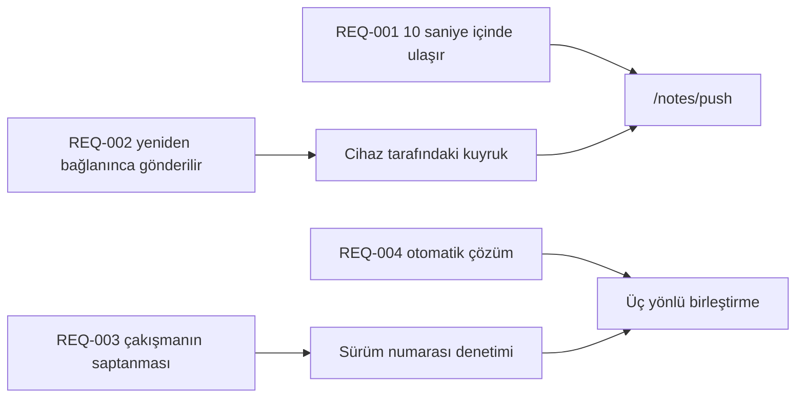

---
navigation:
  order: 30
---

# 2.3 Gereksinimlerin izlenmesi

Gereksinimler, [mimarinin](../03-architecture/README.md) her bir öğesiyle ve [API'nin](../04-api/README.md) her bir uç noktasıyla eşleştirilir. Eşleşmesi olmayan bir gereksinim, uygulanmamış sayılır.

