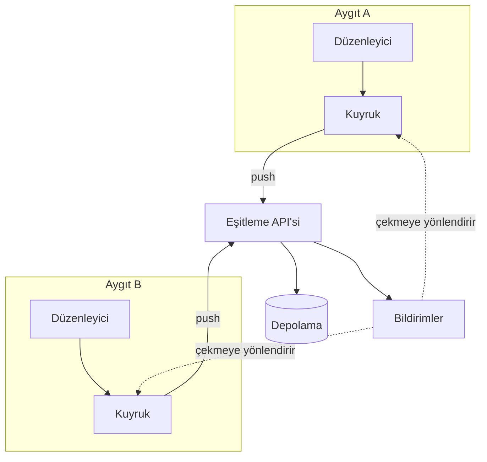

---
navigation:
  order: 10
---

# 3.1 Bileşenler

| Öğe | Rol |
|---|---|
| İstemci | Notlardaki düzenlemeleri izler, değişiklikleri kuyruğa alır ve bağlantı kurulduğunda sunucuya gönderir |
| Eşitleme API'si | Değişiklikleri kabul eder, sürüm numaralarını verir ve diğer aygıtlara dağıtır |
| Depolama | Her notun geçerli içeriğini ve son 30 günlük geçmişini tutar |
| Bildirimler | Bir değişiklik olduğunda, aygıtı çekmeye yönlendiren hafif bir sinyal gönderir |

