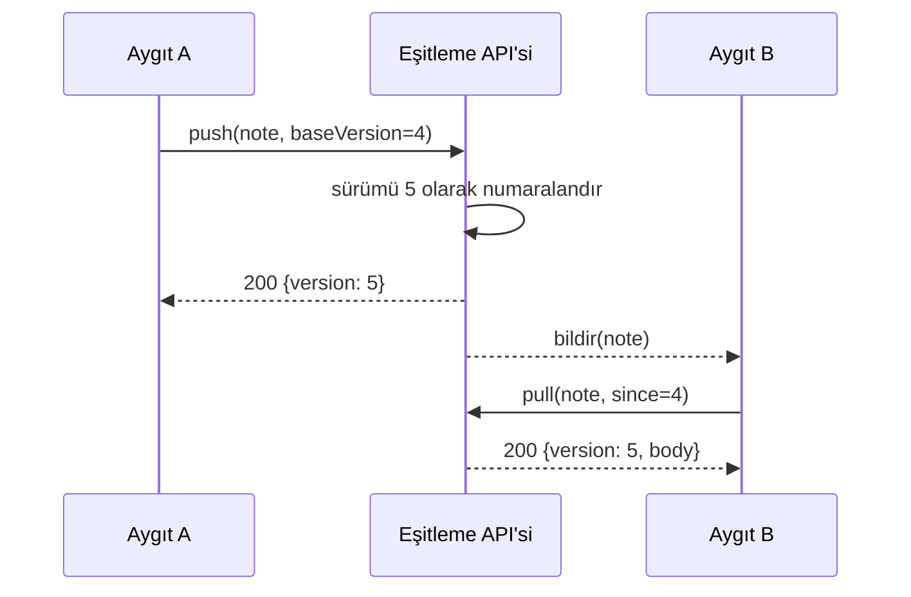

---
navigation:
  order: 20
---

# 3.2 Eşitleme akışı

Aygıt A'daki değişiklik sunucuda yeni bir sürüm alır; bildirimi alan aygıt B de bunu çeker. Bildirim, çekmeyi isteyen bir işarettir; gövdeyi taşımaz.
