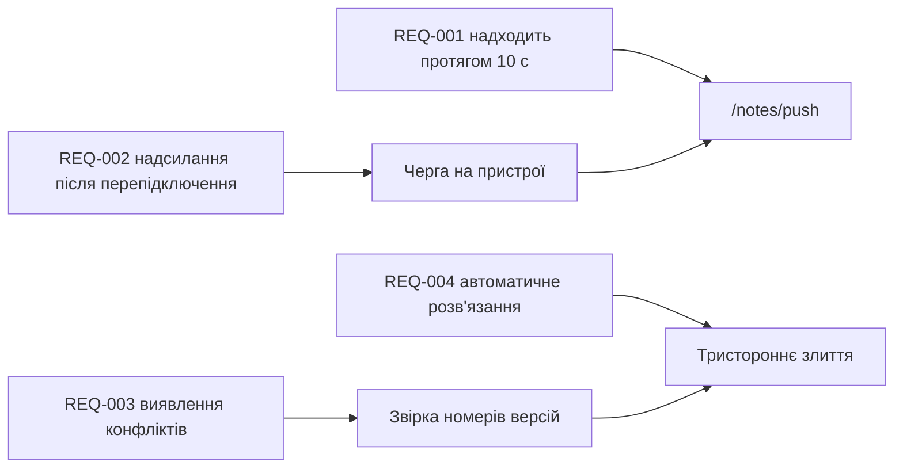

---
navigation:
  order: 30
---

# 2.3 Відстеження вимог

Вимоги зіставляються з елементами [архітектури](../03-architecture/README.md) та кінцевими точками [API](../04-api/README.md). Вимога без зіставлення вважається нереалізованою.

