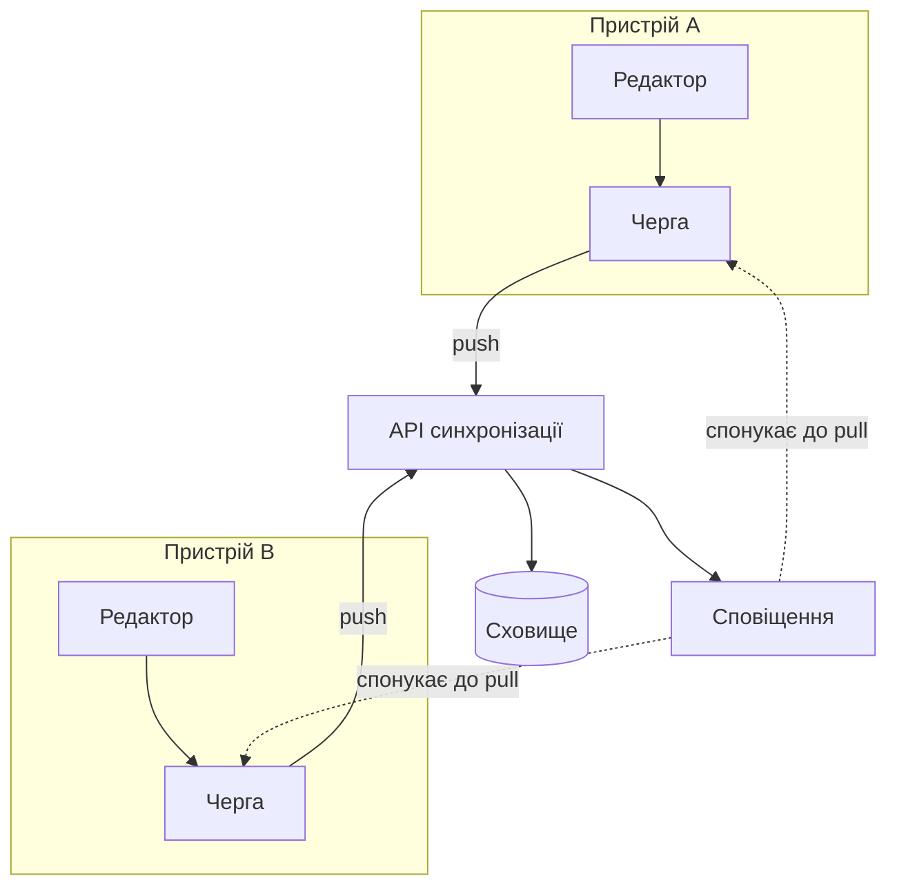

---
navigation:
  order: 10
---

# 3.1 Складники

| Елемент | Роль |
|---|---|
| Клієнт | Стежить за редагуванням нотаток, ставить зміни в чергу й надсилає їх на сервер при з'єднанні |
| API синхронізації | Приймає зміни, присвоює номери версій і розсилає їх на інші пристрої |
| Сховище | Зберігає поточний вміст кожної нотатки та її історію за останні 30 днів |
| Сповіщення | Надсилає легкий сигнал пристрою, на якому сталася зміна, спонукаючи його отримати дані |

