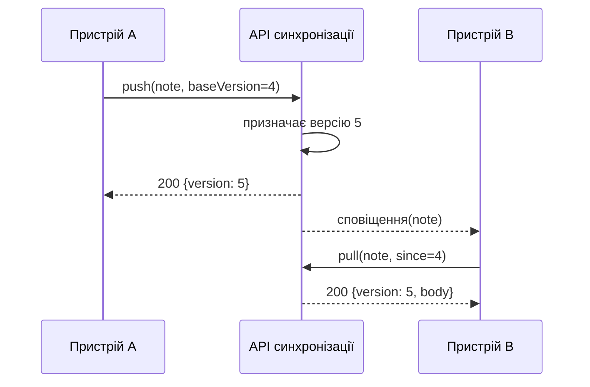

---
navigation:
  order: 20
---

# 3.2 Процес синхронізації

Зміна на пристрої A отримує на сервері нову версію, а пристрій B, отримавши сповіщення, завантажує її. Сповіщення — це лише сигнал завантажити зміну, воно не переносить сам текст.
