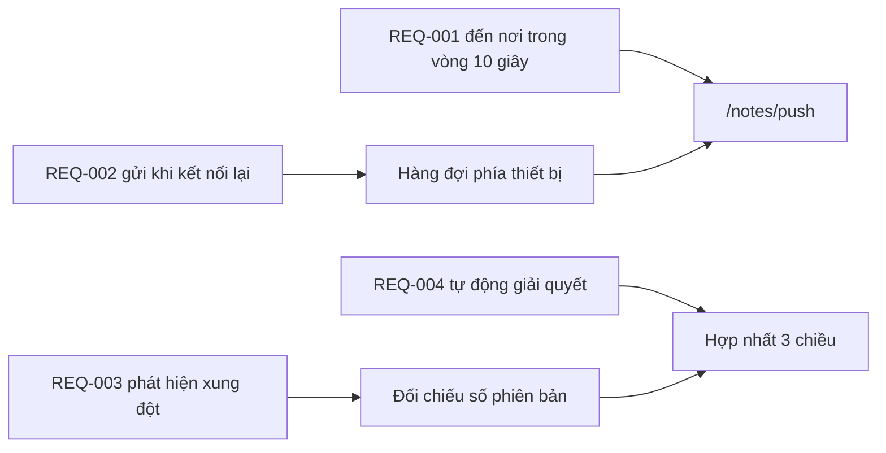

---
navigation:
  order: 30
---

# 2.3 Truy vết yêu cầu

Mỗi yêu cầu được ánh xạ tới các thành phần trong [kiến trúc](../03-architecture/README.md) và các điểm cuối của [API](../04-api/README.md). Yêu cầu không có ánh xạ được xem là chưa hiện thực.

