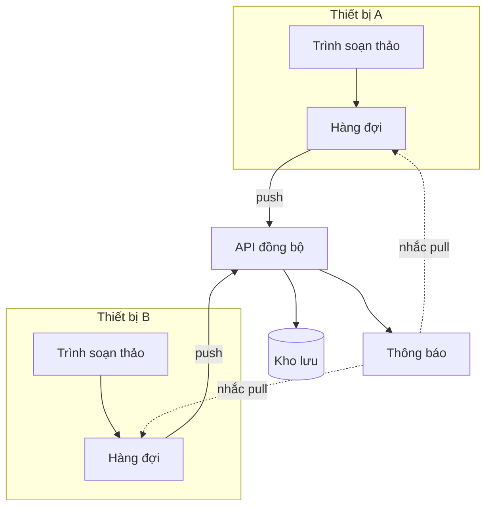

---
navigation:
  order: 10
---

# 3.1 Thành phần

| Thành phần | Vai trò |
|---|---|
| Máy khách | Theo dõi các chỉnh sửa trên ghi chú, xếp các thay đổi vào hàng đợi và gửi lên máy chủ khi có kết nối |
| API đồng bộ | Tiếp nhận các thay đổi, đánh số phiên bản và phân phối đến các thiết bị khác |
| Kho lưu | Nội dung hiện tại của ghi chú và lịch sử 30 ngày gần nhất |
| Thông báo | Gửi tín hiệu nhẹ đến thiết bị có thay đổi để nhắc lấy dữ liệu về |

