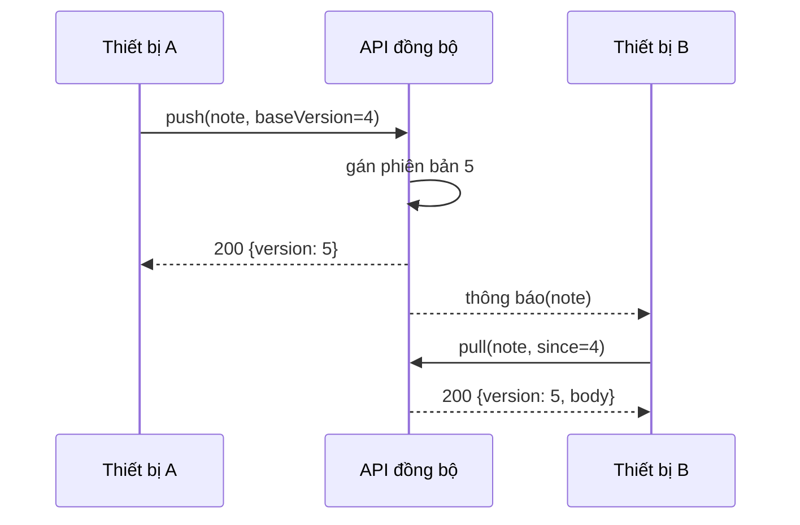

---
navigation:
  order: 20
---

# 3.2 Luồng đồng bộ

Thay đổi ở thiết bị A nhận một phiên bản mới trên máy chủ, và thiết bị B lấy về sau khi nhận thông báo. Thông báo chỉ là tín hiệu nhắc lấy về; nó không mang theo nội dung.
