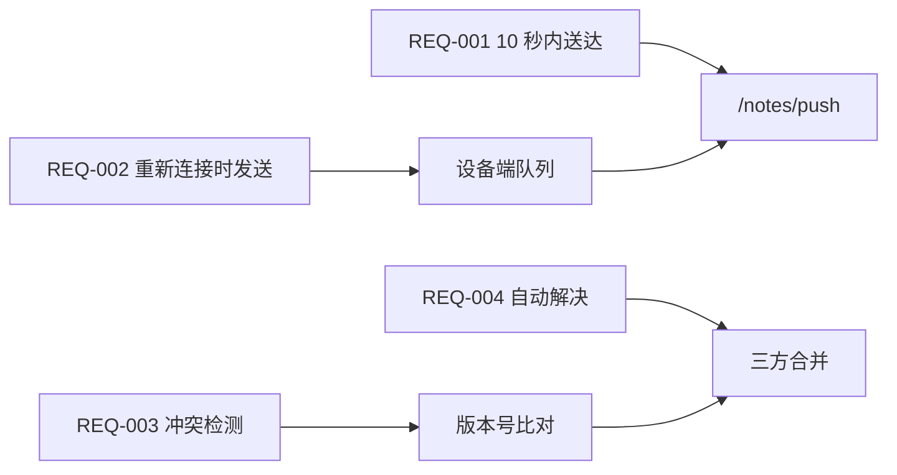

---
navigation:
  order: 30
---

# 2.3 需求追溯

需求与[架构](../03-architecture/README.md)中的各个要素以及 [API](../04-api/README.md) 中的各个端点相对应。没有对应关系的需求视为未实现。

```mermaid
flowchart LR
  REQ001[REQ-001 10 秒内送达] --> PUSH["/notes/push"]
  REQ002[REQ-002 重新连接时发送] --> QUEUE[设备端队列]
  REQ003[REQ-003 冲突检测] --> VERSION[版本号比对]
  REQ004[REQ-004 自动解决] --> MERGE[三方合并]
  QUEUE --> PUSH
  VERSION --> MERGE
```
