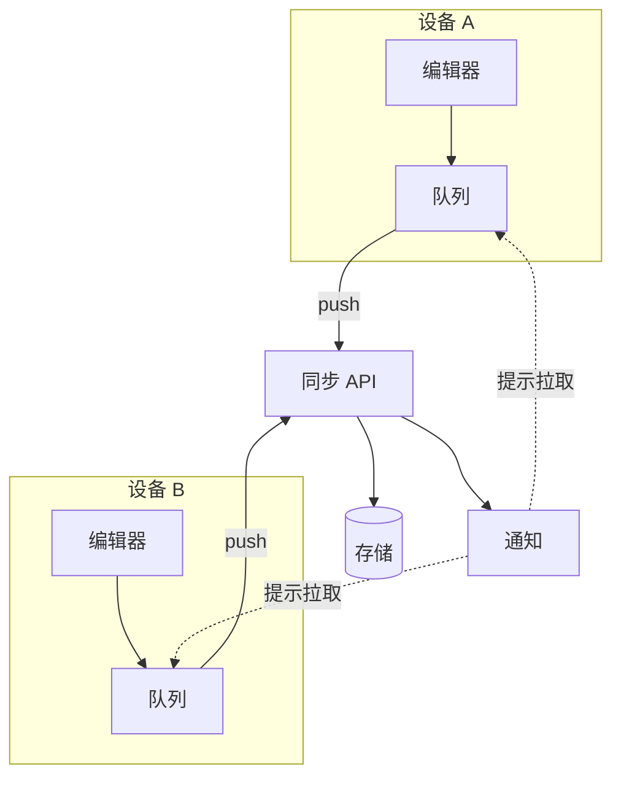

---
navigation:
  order: 10
---

# 3.1 组成部分

| 要素 | 作用 |
|---|---|
| 客户端 | 监视笔记的编辑，将变更放入队列，并在连接时发送到服务器 |
| 同步 API | 接收变更、分配版本号，并分发到其他设备 |
| 存储 | 保存每条笔记的当前内容，以及最近 30 天的历史记录 |
| 通知 | 发生变更时，向设备发送轻量信号，提示其拉取 |

