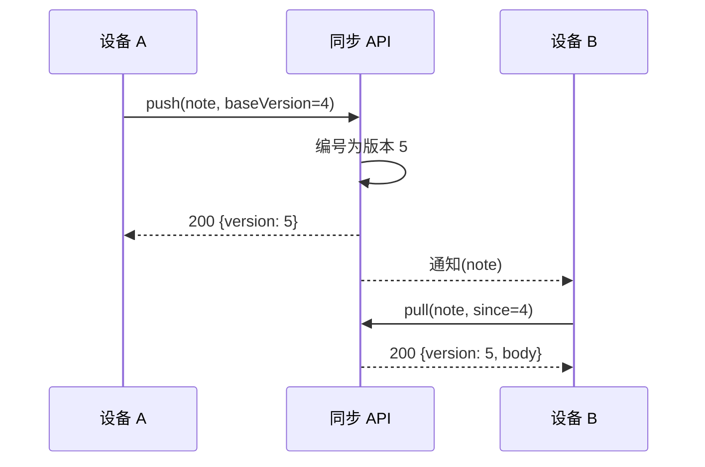

---
navigation:
  order: 20
---

# 3.2 同步流程

```mermaid
sequenceDiagram
  participant A as 设备 A
  participant S as 同步 API
  participant B as 设备 B
  A->>S: push(note, baseVersion=4)
  S->>S: 编号为版本 5
  S-->>A: 200 {version: 5}
  S-->>B: 通知(note)
  B->>S: pull(note, since=4)
  S-->>B: 200 {version: 5, body}
```

设备 A 的更改在服务器上获得新的版本号，收到通知的设备 B 再将其取回。通知只是提示取回的信号，并不携带正文。
