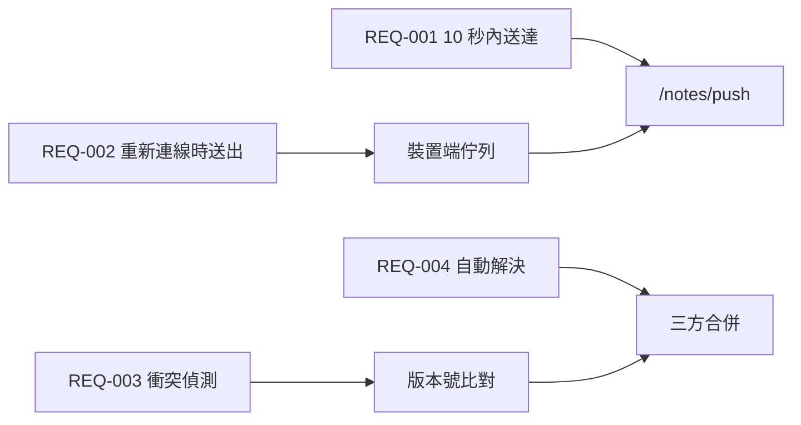

---
navigation:
  order: 30
---

# 2.3 需求追蹤

需求對應到[架構](../03-architecture/README.md)的各個元素與 [API](../04-api/README.md) 的各個端點。沒有對應關係的需求視為未實作。

```mermaid
flowchart LR
  REQ001[REQ-001 10 秒內送達] --> PUSH["/notes/push"]
  REQ002[REQ-002 重新連線時送出] --> QUEUE[裝置端佇列]
  REQ003[REQ-003 衝突偵測] --> VERSION[版本號比對]
  REQ004[REQ-004 自動解決] --> MERGE[三方合併]
  QUEUE --> PUSH
  VERSION --> MERGE
```
