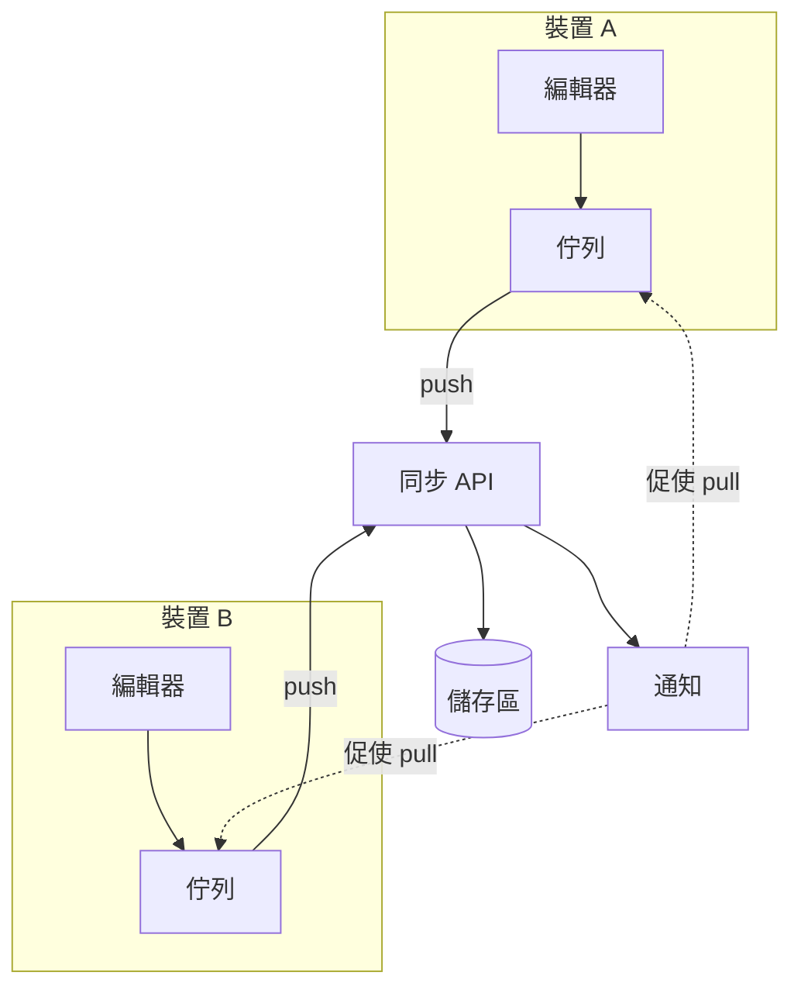

---
navigation:
  order: 10
---

# 3.1 組成元素

| 元素 | 作用 |
|---|---|
| 用戶端 | 監看筆記的編輯、將變更放入佇列，並在連線時送往伺服器 |
| 同步 API | 接收變更、編配版本號，並發送至其他裝置 |
| 儲存區 | 保存筆記的目前內容，以及最近 30 天的歷史記錄 |
| 通知 | 在發生變更時，向裝置送出輕量的訊號，促其取得更新 |

