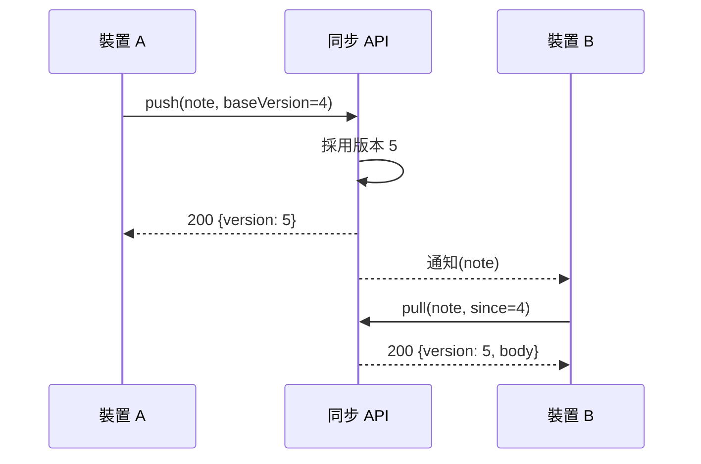

---
navigation:
  order: 20
---

# 3.2 同步流程

```mermaid
sequenceDiagram
  participant A as 裝置 A
  participant S as 同步 API
  participant B as 裝置 B
  A->>S: push(note, baseVersion=4)
  S->>S: 採用版本 5
  S-->>A: 200 {version: 5}
  S-->>B: 通知(note)
  B->>S: pull(note, since=4)
  S-->>B: 200 {version: 5, body}
```

裝置 A 的變更會在伺服器上取得新的版本，收到通知的裝置 B 再行取得。通知只是促請取得的訊號，並不夾帶內文。
